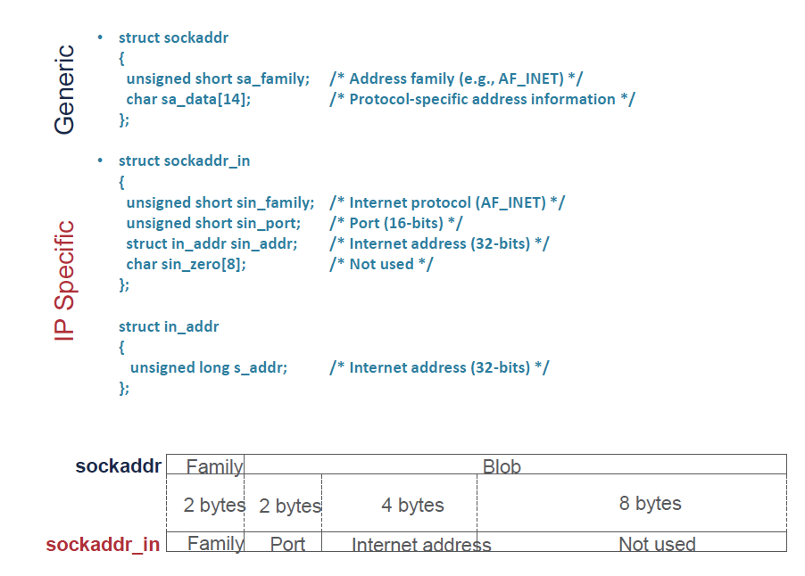
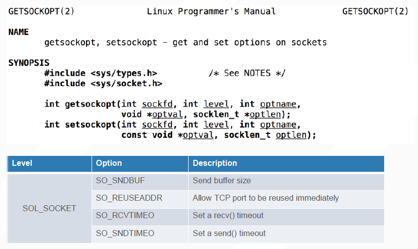
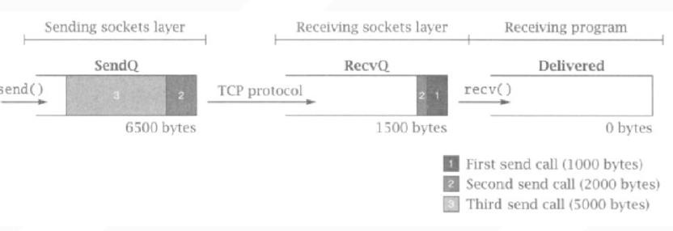
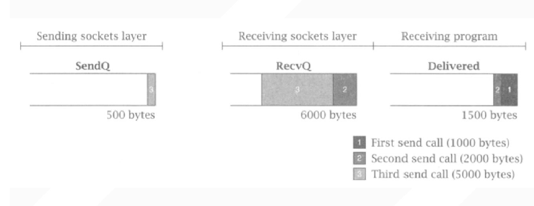
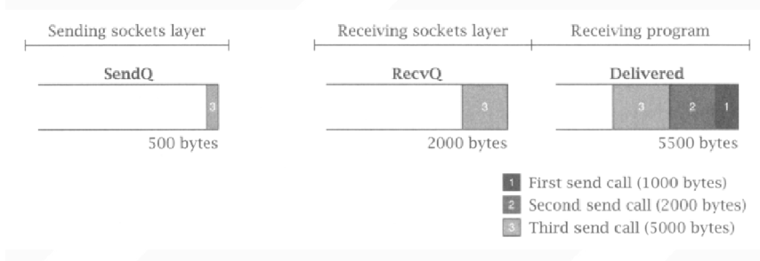
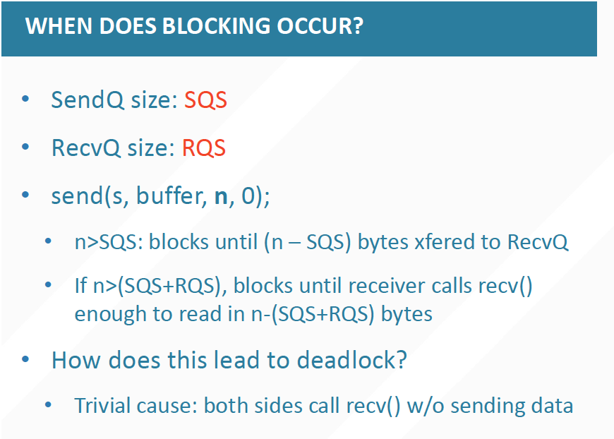

## L04	Sockets

#### Definition

* The point where a local application process attaches to the network

* Interface Between network and application
* Created by application

#### Socket Working Process

* Being created
* Being connected to the network
* Changing messages
* Being closed

#### Ports

Used to identify different applications(processes) in the same host

#### Socket Implementation

##### 1. Socket Family

* PF_INET

  * **INET** denotes the internet family. If u want to communicate with a remote host, u should use this.

  * An **INET** socket is bound to a specific IP address.

  * INET sockets sit at the top of a full TCP/IP stack, with traffic congestion algorithms, backoffs and the like to handle

* PF_UNIX

  * An **UNIX** socket is bound to a special file on our file system.

  * We use it as an a lightweight alternative to an `INET` socket via loopback, when u need communication between processes on the same host.
  * everything is designed to be local to the machine, so its code is much simpler and the communication is faster

* PF_PACKET

  * Used if u want to play with packets at the protocol level, if u are implementing ur own protocol
  * denotes direct access to the network interface (i.e., it bypasses the TCP/IP protocol stack)

**Remark**  AF_ and PF_ have the same values. And u can just use them alternatively, but AF_ seem to be more prevalent.

##### 2. Socket Type

* SOCK_STREAM: denotes a byte stream
* SOCK_DGRAM: an alternative that denotes a message oriented service, such as that provided by UDP

**Remark**  PF_INET and SOCK_STREAM impliy **TCP**

##### 3. Socket in Code

##### 4. Helper Functions

* Printable String to IP address

  ##### int inet_pton()

* Binary to printable string

  ##### const char * inet_ntop

  

* convert the integer from host byte order to network byte order

  ##### uint16_t htons (uint16_t hostshort)

* convert the integer from network byte order to host byte order

  ##### uint16_t ntohs (uint16_t netshort)

  

* connect socket

  ##### int connect( int socket, const struct sockaddr *address, socklen_t address_len)

  socket is the descriptor

  

* Sending data

  ##### ssize_t send(socket,buf,len,flags)

  * return the number of bytes being copied to the OS kernel for transmission
  * blocking semantics of send

* Receiving Responses

  ##### ssize_t recv(int sockfd , void buf , size_t len , int flags);

  * Receives at least one byte
  * 0 is reserved when the other side closed the socket
  * Does not receive the same number of bytes that were sent via send
  * You have to keep reading from the socket until you’ve received all the bytes you need
  * returns the length of the message or datagram in bytes

* Bind (Only for server)

  ##### int bind( int sockfd , const struct sockaddr my_addr , socklen_t addrlen)

  my_addr

  * struct sockaddr_in for IPv4
  * cast (struct sockaddr_in *) to (struct sockaddr)

  **Remark**  Binding a socket means assigning an address and port number to the socket

* Listen(Only for server)

  ##### int listen( int sockfd , int backlog)

  **backlog** Number of pending connections to queue

* Accept(Only for server)

  ##### int accept( int sockfd , struct sockaddr addr , socklen_t addrlen)

Eg: int isock = sockfd , (struct sockaddr_in *) caddr , clen);

#### Socket Options

#### Socket Internals

Suppose the following occasion:

1. rv = connect(s, ...);
2. rv = send(s, buffer0, 1000, 0);
3. rv = send(s, buffer1, 2000, 0);
4. rv = send(s, buffer2, 5000, 0);

5. close(s);

At first, we are sending smoothly.

But then something strange happens.

Our sending process seems to be blocked....But why? 

Preventing Deadlock!!

Like we just mentioned when we were learning how to send a message with a socket, it is blocked while sending.

This is a [link](http://florin.bjdean.id.au/docs/omnimark/omni55/docs/html/concept/717.htm) I found regardidng this topic. U might found it useful.

