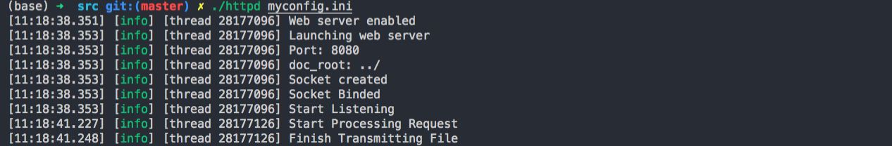
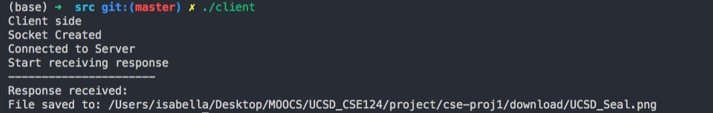

## CSE124 Proj1  Building a Web Server

#### Overview

At a high level, the web server that I built listens for connections on a socket (bound to a specific address and port on a host machine). Clients connect to this socket and use the [TritonHTTP](https://cseweb.ucsd.edu/~gmporter/classes/wi19/cse124/post/2019/01/12/tritonhttp-specification/) protocol to retrieve files from the server


#### Characteristics

1. ##### Response adopts TritionHTTP routine

   ```
   // Example response
   HTTP/1.1 200 OK<CR><LF>
   
   Server: Myserver 1.0<CR><LF>
   
   Last-Modified: Sun, 19 Aug 18 18:02:49 -0700<CR><LF>
   
   Content-Length: 12812<CR><LF>
   
   Content-Type: image/jpeg<CR><LF>
   
   <CR><LF>
   ```

* Support MIME types

  ```
  Content-Type: image/jpeg<CR><LF>
  ```

  

* Error Response

  ```
  "403":	No file read permission
  "404":	Other errors, file doesn't exist etc
  "200":	Success
  ```


2. ##### Support all kinds of files

   In the sample_htocs, we have html, jpg and png files

   

3. ##### Multi-thread processing

   Use c++11 thread library.

   

4. ##### Automatically download data file to specified path

   In the sample client, I set the file name accepted from the server to be the same as the one from the server.


#### Environment

c++11


#### Run

```
1. Enter progrom folder
     cd src
1. build the files
	 make
2. In one terminal, run the server code
	 ./httpd myconfig.ini
3. In the other terminal, run the client code
	 ./client
```

##### Server:



##### Client:



